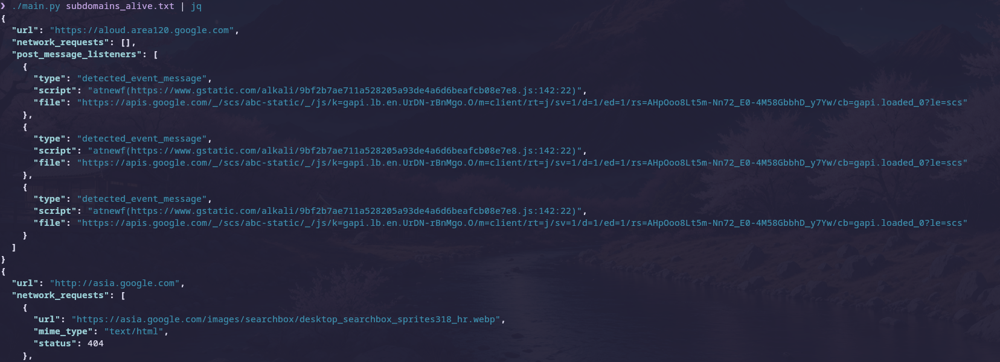

# DynamicWebScanning

This script scans for POST message listeners and broken links generated dynamically by websites. Many recon tools rely on fetching pages via GET requests for static analysis. While this approach is efficient when scanning against a large number of targets, it might miss valuable information loaded during a session.

### Usage
```
chmod +x main.py
```
```
cat subdomains.txt | main.py | jq
```
```
main.py subdomains.txt
```
```
main.py -u host.com
```


